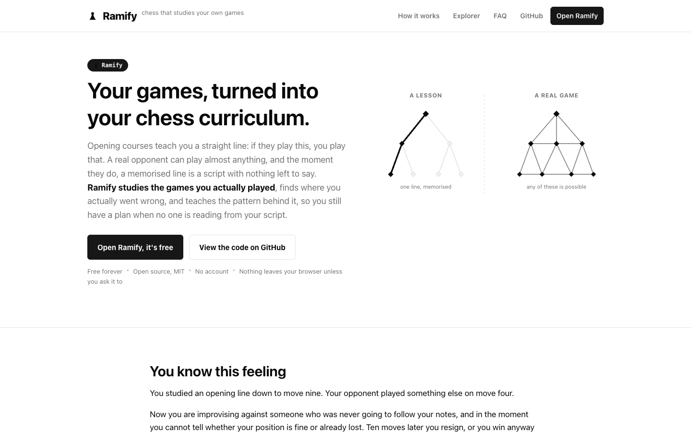
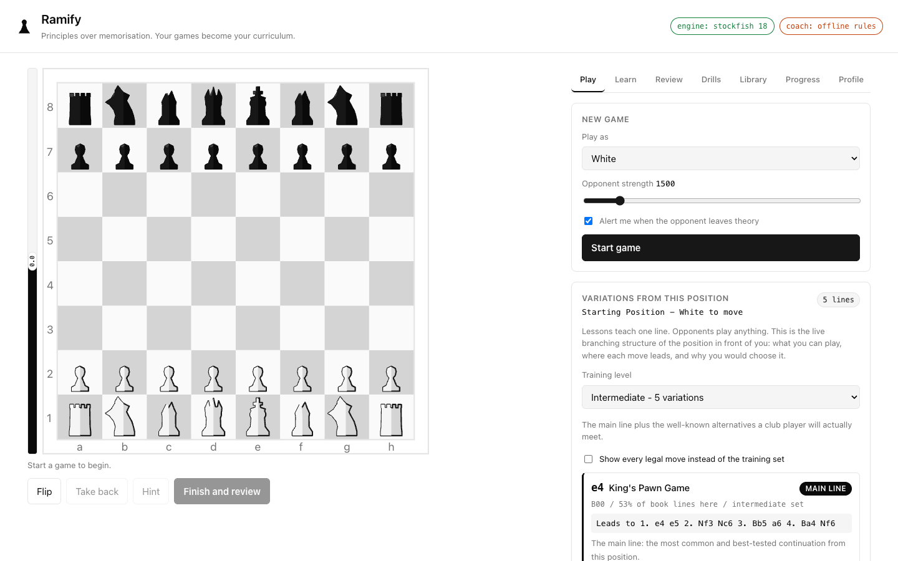
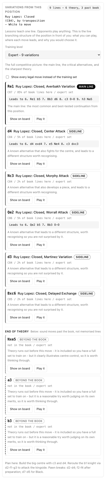
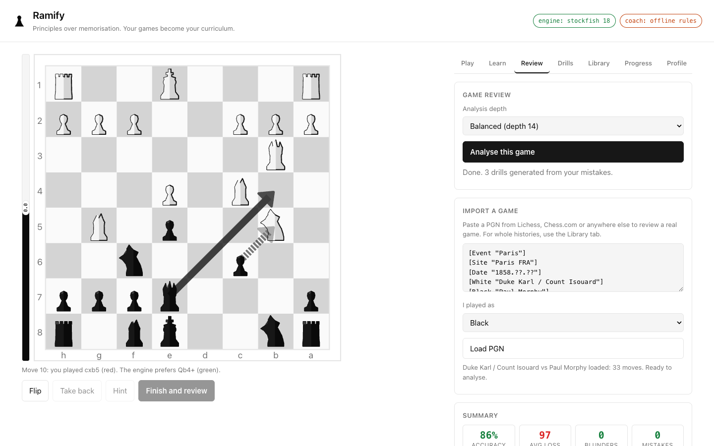

# Ramify

**Chess lessons teach you a tree. Real opponents play a graph. Ramify teaches
the principles behind the moves and shows you the live variation fan instead
of a memorised line, so you still have a plan the moment theory runs out.**

[](https://github.com/RagnarPitla/chess-local-learning/actions/workflows/pages.yml)
[](LICENSE)

### [**Open Ramify - live and free**](https://ragnarpitla.github.io/chess-local-learning/)

No install, no account, no upload. Runs entirely in your browser.

---

## The insight

An opening course teaches you a **tree**: if they play X, you play Y, and if
they play Z instead, you play W. A real opponent plays a **graph** - they can
play almost anything, at any point, including moves no course covers. The
instant they step off the line you memorised, the script breaks and you are
left with no model of the position at all. Memorising deeper does not fix
this, because the tree is infinite and your opponent was never reading from
it.

Ramify does not ask you to memorise a line. From any position it shows you
the **live variation fan** - every reply that matters, not just the one a
book expects - and when your own games show a real mistake, it names the
pattern behind it (hanging piece, allowed fork, bad bishop, ...) instead of
just saying the engine prefers something else. What transfers to your next
game is the principle, not the script.

## Screenshots

<!-- Generated separately into docs/screenshots/ - see note below. -->

| | |
| --- | --- |
|  |  |
|  |  |

If an image above looks broken, the screenshot set is generated by a
separate pass over the live app into `docs/screenshots/*.png` and may not be
in place yet, or may use slightly different file names - check that
directory for the current set.

## This is free. Forever.

- **No cost to you.** The live site above is a static page on GitHub Pages -
  hosting is free, and there is nothing to buy.
- **No account, no upload.** Your games, profile and progress stay in your
  own browser (see [Data and privacy](#data-and-privacy)).
- **MIT licensed.** Fork it, self-host it, change it, ship it under your own
  name. See [Licence and credits](#licence-and-credits).
- **Run your own copy** in under a minute - see the quickstart right below -
  or deploy your own public copy for free; see
  [`docs/DEPLOY.md`](docs/DEPLOY.md) for GitHub Pages, Cloudflare Pages and
  Vercel, all free tiers.

## Quickstart

Verified from a fresh `git clone` on Node 22:

```bash
git clone https://github.com/RagnarPitla/chess-local-learning.git
cd chess-local-learning
npm ci
npm start
# open http://127.0.0.1:5173/       -> the landing page
# open http://127.0.0.1:5173/app/   -> the trainer
```

`npm ci` rather than `npm install`: it installs straight from
`package-lock.json`, which is what a fresh clone should use. This project
has exactly three runtime dependencies and no dev dependencies, so
`npm install` works too, but `npm ci` installs exactly what the lockfile
pins, which is what a fresh clone should use and what was verified here.

That's the whole setup: no bundler, no database, no API key. The first load
fetches the ~7 MB Stockfish WASM engine from your own server and caches it.
Node needs to be at least version 20 (`engines` in `package.json`); this was
verified on Node 22.22.3.

### Optional: a server-held LLM coach

Everything works with no key at all - the coach falls back to a rule-based
explainer built on the same pattern library. To have an LLM write the
explanations instead, when running your own server:

```bash
cp .env.example .env
# then add ANTHROPIC_API_KEY=sk-ant-... (or an OpenAI-compatible key)
npm start
```

The key stays server-side; the browser only ever sends structured JSON
(FEN, evaluations, pattern tags) to `/api/coach`. The header pill shows which
coach is live: `coach: llm` or `coach: offline rules`.

## What ships today

Grounded in the code as of this README, not a roadmap:

- **Variation explorer** - from any position, every legal reply, book moves
  named and scored by popularity, everything else marked as a novelty. A
  difficulty selector (`DIFFICULTY_PRESETS` in `public/js/explorer.js`) sizes
  the training fan to **3 / 5 / 7 / 9** lines for Beginner / Intermediate /
  Advanced / Expert.
- **A 46-lesson curriculum** (`public/data/lessons-data.js`) across five
  tracks: 7 Fundamentals, 10 Tactics, 9 Positional/Structure, 14 Opening
  Families, 6 Endgames. Lessons are recommended against your own weakness
  profile, and each tracks its own mastery state.
- **Game import** from Lichess or Chess.com PGN paste, or by pulling a
  Chess.com username's recent game archive directly
  (`public/js/import.js`) - hundreds of games at once.
- **Stockfish-driven review** - Stockfish 18 (WASM, in a Web Worker) scores
  every position; accuracy, centipawn loss and win-probability drop combine
  to grade each move, and every real mistake is tagged with a concrete
  pattern (static-exchange-evaluated hanging pieces, forks, pins, skewers,
  overloaded defenders, pawn-structure flaws, bad bishops, king safety,
  opening-principle violations).
- **Progress and mastery tracking** (`public/js/progress.js`) - lesson and
  drill completions, streaks, and an honest per-topic mastery signal, kept
  separate from but informed by the weakness profile.
- **An opening library** - a named, plan-based book (`public/js/openings.js`)
  covering major systems (Ruy Lopez, Italian, Sicilian, French, Caro-Kann,
  and more) layered on a generated ECO reference of 3,810 codes
  (`public/data/openings-data.js`), used both to name what you played and to
  power the variation explorer.
- **Drills from your own mistakes** - puzzles built from the actual
  positions you got wrong, ordered by Leitner spacing and by what is costing
  you the most, plus optional themed puzzles from the Lichess API.
- **A persistent game library** (`public/js/library.js`) - every imported or
  played game, searchable and filterable, stored in IndexedDB so it scales
  past what `localStorage` alone could hold.

### The learning loop

```
   play a game (or import a PGN, or pull your Chess.com history)
              |
              v
   Stockfish scores every position
              |
              v
   each mistake is tagged with a named pattern
   (hanging piece, allowed fork, overloaded defender, bad bishop, ...)
              |
              v
   the coach explains what you missed, in words
              |
              v
   drills are generated from your own blunders
              |
              v
   a weakness profile ranks what keeps costing you,
   the Learn tab recommends lessons against it,
   and Leitner spacing decides what comes back, and when
              |
              +--> repeat
```

### Deviation handling

When your opponent leaves the book, a panel appears that does **not** quote
theory at you. It names the opening you were in, your side's plan, what the
position looks like right now (material, development, centre, open files),
and which principles apply - because that is the entire point: when the tree
ends, you fall back on understanding, not on recall.

## Architecture

**A static site, on purpose.** There is no backend in production: `dist/`
(built by `node scripts/build-static.mjs`) is plain HTML/CSS/JS plus vendored
copies of chess.js, cm-chessboard and Stockfish's WASM build, all loaded as
native ES modules through an import map - no bundler, no build step for
`public/js/*.js` itself. Everything a user does - games, profile, progress,
mastery - is stored **locally in their own browser** (`localStorage` plus
IndexedDB for the game library) and never has to leave the machine.

That is a deliberate product decision, not a missing feature:

- **Zero hosting cost.** A static site on GitHub Pages, Cloudflare Pages or
  Vercel's free tier costs nothing to run at any realistic scale for this
  project.
- **No user data leaves the machine** unless the user chooses to sync (an
  optional coach key, or the optional Lichess puzzle fetch) - there is no
  account and nothing to breach.
- **Anyone can fork it and self-host their own copy**, permanently, without
  needing to run or pay for a server.

`server.js` still exists and is genuinely useful for local development - it
serves `public/` directly (so nothing needs building while you work), proxies
the optional LLM coach call, and opportunistically syncs the profile/games to
local JSON files - but it is not what the live site runs on.

Routing is the same shape in both places: `/` is the landing page, `/app/` is
the trainer. `server.js` serves this live from `public/`; the build script
produces the identical layout in `dist/` (see `scripts/build-static.mjs`).

```
server.js                 Dev-only Node server: static files + vendor
                          mounts, the coach proxy, opportunistic
                          profile/game sync.
scripts/build-static.mjs  Builds dist/: the real, hostable artifact.
lib/coach-prompts.js      Shared coach logic used by server.js and both
                          serverless functions below - one prompt, one
                          place.
functions/api/coach.js    Cloudflare Pages Function - the coach on
                          Cloudflare.
api/coach.js              Vercel serverless function - the coach on Vercel.

public/js/
  engine.js               Stockfish UCI over a Web Worker, promise-based
                          queue
  analysis.js             evaluation maths: win %, accuracy, centipawn
                          loss
  patterns.js             static-exchange evaluation, forks, pins,
                          skewers, pawn structure, bad bishops, king
                          safety
  openings.js             plan-based opening book: names, structures,
                          plans
  explorer.js             the live variation fan and its difficulty
                          presets
  lessons.js              the 46-lesson curriculum and recommendations
  progress.js             mastery and streak tracking
  profile.js              weakness profile, Leitner spaced repetition
  import.js               PGN paste and Chess.com game import
  library.js              persistent, searchable game library
                          (IndexedDB)
  puzzles.js              drills from your games, queue ordering,
                          grading
  coach.js                LLM coach client, with a full offline
                          fallback
  board.js                cm-chessboard wrapper: markers, arrows,
                          promotion
  app.js                  the controller wiring all of the above
                          together
```

See `docs/DECISIONS.md` for the fuller design rationale behind these calls,
and `docs/DEPLOY.md` for exactly how to put your own copy on the internet for
free.

## Testing

```bash
npm test          # unit tests over the pure logic - no browser, no engine
npm run test:e2e  # end-to-end checks in real headless Chrome
npm run test:all
npm run build     # produce dist/
npm run build:check  # verify dist/ is actually deployable
```

Current local verification: `npm test` 180/180, `npm run test:e2e`
52/52 in real Chrome, `npm run build:check` passing at both the root base and
the GitHub Pages project base (`/chess-local-learning/`). See
[`CONTRIBUTING.md`](CONTRIBUTING.md) for what each layer actually covers.

## Data and privacy

Everything is local by default. Your weakness profile and progress live in
`localStorage`; your game library lives in IndexedDB; none of it requires an
account or a server. When running the dev server, the profile and games also
mirror to `data/profile.json` and `data/games.json` on your own machine
(gitignored) purely as a convenience backup - delete the folder, or use
**Export** and **Reset** on the Profile tab, to clear everything.

The only outbound calls are ones you opt into: the LLM coach if a key is
configured (or you paste your own, see `docs/DEPLOY.md`), a Chess.com game
import if you ask for one, and the Lichess puzzle API if you press "Fetch a
themed puzzle".

## Licence and credits

This project is **MIT licensed** (see [`LICENSE`](LICENSE)). Stockfish is
**GPL-3.0** and is used unmodified, as a separate runtime process communicating
over UCI - it is never linked into or modified as part of this MIT-licensed
code. The full dependency, licence and attribution ledger, including the
reasoning for why the GPL-3.0 engine and the MIT app can coexist like this,
lives in [`docs/CREDITS.md`](docs/CREDITS.md) - that is the source of truth,
not this section.

## Contributing

Contributions are welcome, especially new lessons and opening lines - see
[`CONTRIBUTING.md`](CONTRIBUTING.md) for how the test layers work, the file
ownership convention, code style, and exactly how to propose one.
